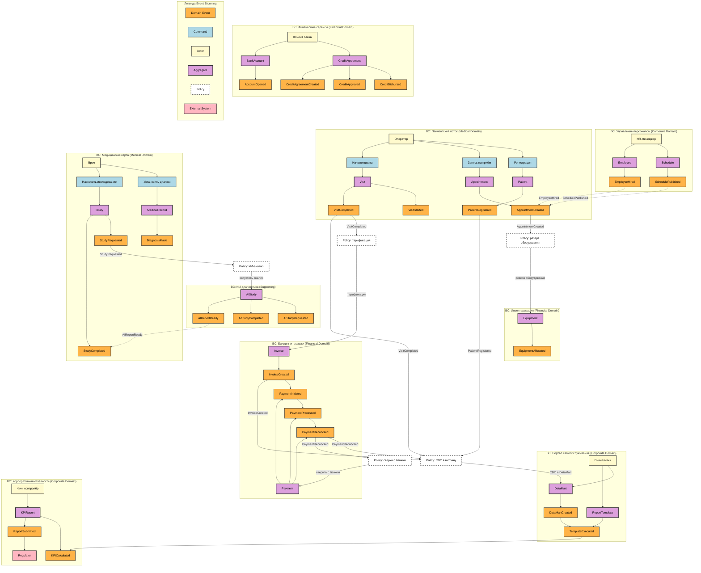

```mermaid
flowchart TB
    %% Цветовая схема Event Storming
    classDef actor fill:#FFFACD,stroke:#333,stroke-width:2px,color:#000
    classDef command fill:#ADD8E6,stroke:#333,stroke-width:2px,color:#000
    classDef aggregate fill:#DDA0DD,stroke:#333,stroke-width:3px,color:#000
    classDef event fill:#FFB347,stroke:#333,stroke-width:2px,color:#000
    classDef policy fill:#FFFFFF,stroke:#333,stroke-width:2px,color:#000,stroke-dasharray: 5 5
    classDef external fill:#FFB6C1,stroke:#333,stroke-width:2px,color:#000

    %% ============================================
    %% ПАКЕТ 1: ПАЦИЕНТСКИЙ ПОТОК
    %% ============================================
    subgraph BC1 ["BC: Пациентский поток (Medical Domain)"]
        direction TB
        Actor1["Оператор"]:::actor
      
        Cmd1["Регистрация"]:::command
        Cmd2["Запись на приём"]:::command
        Cmd3["Начало визита"]:::command
      
        Agg1["Patient"]:::aggregate
        Agg2["Appointment"]:::aggregate
        Agg3["Visit"]:::aggregate
      
        Ev1["PatientRegistered"]:::event
        Ev2["AppointmentCreated"]:::event
        Ev3["VisitStarted"]:::event
        Ev4["VisitCompleted"]:::event
      
        Actor1 --> Cmd1
        Actor1 --> Cmd2
        Actor1 --> Cmd3
      
        Cmd1 --> Agg1
        Cmd2 --> Agg2
        Cmd3 --> Agg3
      
        Agg1 --> Ev1
        Agg2 --> Ev2
        Agg3 --> Ev3
        Agg3 --> Ev4
    end

    %% ============================================
    %% ПАКЕТ 2: МЕДИЦИНСКАЯ КАРТА
    %% ============================================
    subgraph BC2 ["BC: Медицинская карта (Medical Domain)"]
        direction TB
        Actor2["Врач"]:::actor
      
        Cmd4["Установить диагноз"]:::command
        Cmd5["Назначить исследование"]:::command
      
        Agg4["MedicalRecord"]:::aggregate
        Agg5["Study"]:::aggregate
      
        Ev5["DiagnosisMade"]:::event
        Ev6["StudyRequested"]:::event
        Ev7["StudyCompleted"]:::event
      
        Actor2 --> Cmd4
        Actor2 --> Cmd5
      
        Cmd4 --> Agg4
        Cmd5 --> Agg5
      
        Agg4 --> Ev5
        Agg5 --> Ev6
        Agg5 --> Ev7
    end

    %% ============================================
    %% ПАКЕТ 3: ИИ-ДИАГНОСТИКА
    %% ============================================
    subgraph BC3 ["BC: ИИ-диагностика (Supporting)"]
        direction TB
        Agg6["AIStudy"]:::aggregate
      
        Ev8["AIStudyRequested"]:::event
        Ev9["AIStudyCompleted"]:::event
        Ev10["AIReportReady"]:::event
      
        Agg6 --> Ev8
        Agg6 --> Ev9
        Agg6 --> Ev10
    end

    %% ============================================
    %% ПАКЕТ 4: ИНВЕНТАРИЗАЦИЯ
    %% ============================================
    subgraph BC4 ["BC: Инвентаризация (Financial Domain)"]
        direction TB
        Agg7["Equipment"]:::aggregate
        Ev11["EquipmentAllocated"]:::event
      
        Agg7 --> Ev11
    end

    %% ============================================
    %% ПАКЕТ 5: БИЛЛИНГ И ПЛАТЕЖИ
    %% ============================================
    subgraph BC5 ["BC: Биллинг и платежи (Financial Domain)"]
        direction TB
        Agg8["Invoice"]:::aggregate
        Agg9["Payment"]:::aggregate
      
        Ev12["InvoiceCreated"]:::event
        Ev13["PaymentInitiated"]:::event
        Ev14["PaymentProcessed"]:::event
        Ev15["PaymentReconciled"]:::event
      
        Agg8 --> Ev12
        Agg9 --> Ev13
        Agg9 --> Ev14
        Agg9 --> Ev15
    end

    %% ============================================
    %% ПАКЕТ 6: ФИНАНСОВЫЕ СЕРВИСЫ
    %% ============================================
    subgraph BC6 ["BC: Финансовые сервисы (Financial Domain)"]
        direction TB
        Actor4["Клиент банка"]:::actor
      
        Agg10["BankAccount"]:::aggregate
        Agg11["CreditAgreement"]:::aggregate
      
        Ev16["AccountOpened"]:::event
        Ev17["CreditAgreementCreated"]:::event
        Ev18["CreditApproved"]:::event
        Ev19["CreditDisbursed"]:::event
      
        Actor4 --> Agg10
        Actor4 --> Agg11
      
        Agg10 --> Ev16
        Agg11 --> Ev17
        Agg11 --> Ev18
        Agg11 --> Ev19
    end

    %% ============================================
    %% ПАКЕТ 7: УПРАВЛЕНИЕ ПЕРСОНАЛОМ
    %% ============================================
    subgraph BC7 ["BC: Управление персоналом (Corporate Domain)"]
        direction TB
        Actor5["HR-менеджер"]:::actor
      
        Agg12["Schedule"]:::aggregate
        Agg13["Employee"]:::aggregate
      
        Ev20["SchedulePublished"]:::event
        Ev21["EmployeeHired"]:::event
      
        Actor5 --> Agg12
        Actor5 --> Agg13
      
        Agg12 --> Ev20
        Agg13 --> Ev21
    end

    %% ============================================
    %% ПАКЕТ 8: ПОРТАЛ САМООБСЛУЖИВАНИЯ
    %% ============================================
    subgraph BC8 ["BC: Портал самообслуживания (Corporate Domain)"]
        direction TB
        Actor6["BI-аналитик"]:::actor
      
        Agg14["DataMart"]:::aggregate
        Agg15["ReportTemplate"]:::aggregate
      
        Ev22["DataMartCreated"]:::event
        Ev23["TemplateExecuted"]:::event
      
        Actor6 --> Agg14
        Actor6 --> Agg15
      
        Agg14 --> Ev22
        Agg15 --> Ev23
    end

    %% ============================================
    %% ПАКЕТ 9: КОРПОРАТИВНАЯ ОТЧЁТНОСТЬ
    %% ============================================
    subgraph BC9 ["BC: Корпоративная отчётность (Corporate Domain)"]
        direction TB
        Actor7["Фин. контролёр"]:::actor
      
        Agg16["KPIReport"]:::aggregate
      
        Ev24["KPICalculated"]:::event
        Ev25["ReportSubmitted"]:::event
      
        Ext1["Regulator"]:::external
      
        Actor7 --> Agg16
        Agg16 --> Ev24
        Agg16 --> Ev25
        Ev25 --> Ext1
    end

    %% ============================================
    %% ПОЛИТИКИ (Policy)
    %% ============================================
    Pol1["Policy: тарификация"]:::policy
    Pol2["Policy: ИИ-анализ"]:::policy
    Pol3["Policy: резерв оборудования"]:::policy
    Pol4["Policy: CDC в витрину"]:::policy
    Pol5["Policy: сверка с банком"]:::policy

    %% ============================================
    %% ВЕРТИКАЛЬНОЕ РАСПОЛОЖЕНИЕ ПАКЕТОВ
    %% ============================================
    BC1 ~~~ BC2
    BC2 ~~~ BC3
    BC3 ~~~ BC4
    BC4 ~~~ BC5
    BC5 ~~~ BC6
    BC6 ~~~ BC7
    BC7 ~~~ BC8
    BC8 ~~~ BC9

    %% ============================================
    %% МЕЖДОМЕННЫЕ СВЯЗИ
    %% ============================================
  
    %% Медицинский домен → ИИ-диагностика
    Ev6 -->|"StudyRequested"| Pol2
    Pol2 -->|"запустить анализ"| Agg6

    %% ИИ-диагностика → Медицинская карта
    Ev10 -.->|"AIReportReady"| Ev7

    %% Пациентский поток → Инвентаризация
    Ev2 -->|"AppointmentCreated"| Pol3
    Pol3 -->|"резерв оборудования"| Agg7

    %% Пациентский поток → Биллинг
    Ev4 -->|"VisitCompleted"| Pol1
    Pol1 -->|"тарификация"| Agg8

    %% Биллинг: внутренние связи
    Ev12 --> Ev13
    Ev13 --> Ev14
    Ev14 --> Ev15

    %% Управление персоналом → Пациентский поток
    Ev20 -.->|"SchedulePublished"| Ev2
    Ev21 -.->|"EmployeeHired"| Ev2

    %% Все домены → Портал самообслуживания (CDC)
    Ev1 -->|"PatientRegistered"| Pol4
    Ev4 -->|"VisitCompleted"| Pol4
    Ev12 -->|"InvoiceCreated"| Pol4
    Ev15 -->|"PaymentReconciled"| Pol4
    Pol4 -->|"CDC в DataMart"| Agg14

    %% Портал самообслуживания → Корпоративная отчётность
    Ev22 --> Ev23
    Ev23 --> Ev24

    %% Биллинг → Корпоративная отчётность
    Ev15 -->|"PaymentReconciled"| Pol5
    Pol5 -->|"сверить с банком"| Agg9

    %% ============================================
    %% ЛЕГЕНДА
    %% ============================================
    subgraph Legend ["Легенда Event Storming"]
        direction LR
        L1["Domain Event"]:::event
        L2["Command"]:::command
        L3["Actor"]:::actor
        L4["Aggregate"]:::aggregate
        L5["Policy"]:::policy
        L6["External System"]:::external
    end
```
