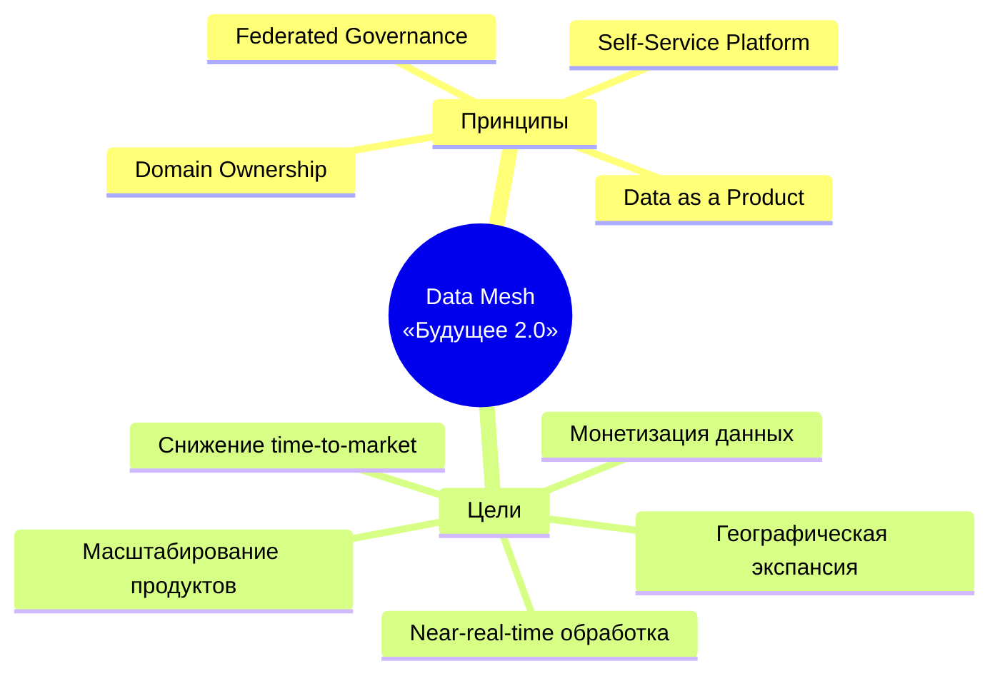
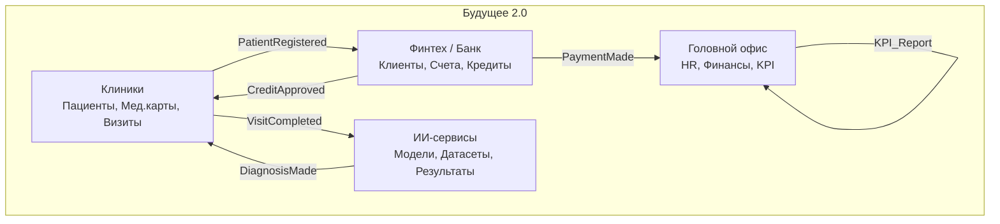
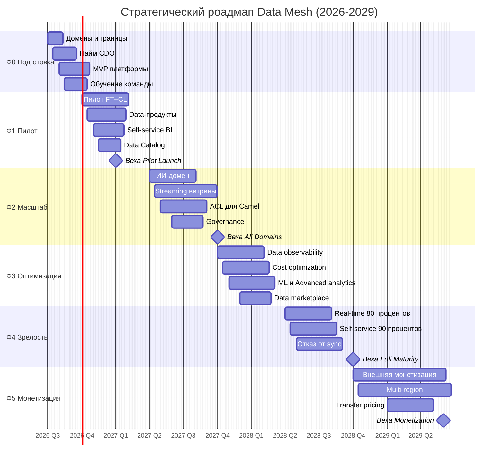
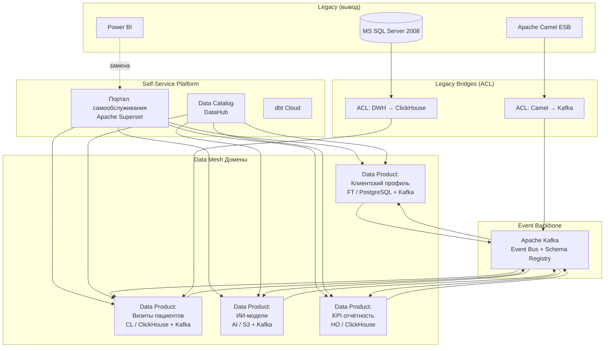
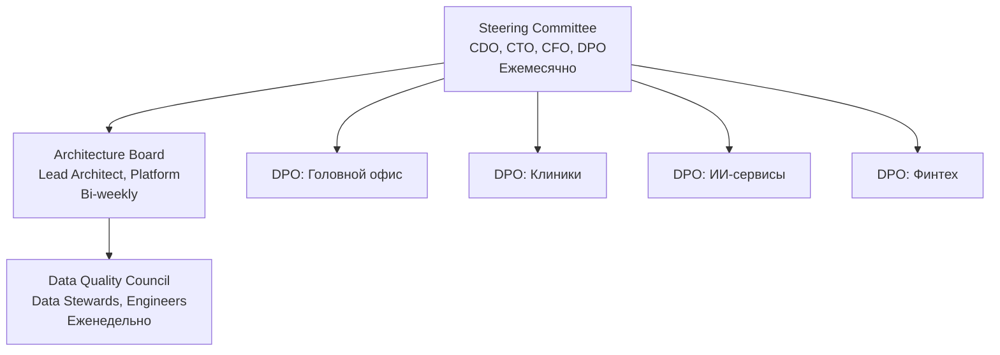
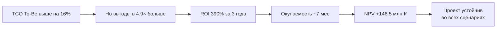

# Стратегический роадмап внедрения Data Mesh для «Будущего 2.0

## Цели и принципы

## Ключевые роли

| **Роль**       | **Кол-во** | **Ответственность**                                 | **KPI**                                            |
| ------------------------ | --------------------- | ------------------------------------------------------------------------ | -------------------------------------------------------- |
| Chief Data Officer (CDO) | 1                     | Стратегия, бюджет, steering committee                     | ROI программы                                   |
| Data Product Owner (DPO) | 4 (по домену) | Стратегия data-продуктов, SLA, приоритеты    | NPS data-продуктов, SLA compliance              |
| Data Engineer            | 8                     | ETL/ELT, streaming, data quality, витрины                         | % автоматизации, DQ score, uptime           |
| Platform Engineer        | 4                     | K8s, Terraform, observability, security                                  | Platform uptime, cost efficiency                         |
| BI-аналитик      | 5                     | Self-service отчёты, дашборды, обучение            | % self-service, time-to-insight                          |
| Data Steward             | 3                     | Метаданные, compliance, доступ, документация | % данных с документацией, compliance |
| **Всего**     | **25**          |                                                                          |                                                          |

## Домены и bounded contexts

## Этапы внедрения (Gantt)

## Привязка этапов к бизнес-целям

| **Фаза**                | **Срок** | **Бизнес-цель**                    | **Ключевые результаты**        | **KPI**                     |
| --------------------------------- | ------------------ | -------------------------------------------------- | ------------------------------------------------------ | --------------------------------- |
| 0. Подготовка           | 0–3 мес        | Фундамент                                 | 4 домена, MVP платформы, команда | 80% команды обучено |
| 1. Пилот                     | 3–6 мес        | Сокращение time-to-market                | 3–5 data-продуктов, 10+ дашбордов   | Time-to-market −50%              |
| 2. Масштабирование | 6–12 мес       | Масштабирование продуктов  | Все 4 домена на Data Mesh                   | 20+ data-продуктов       |
| 3. Оптимизация         | 12–18 мес      | Снижение TCO                               | Cost per product −30%                                 | TCO −30%                         |
| 4. Зрелость               | 18–24 мес      | Near-real-time                                     | 80% данных в real-time                          | Query latency <10 сек          |
| 5. Монетизация         | 24–36 мес      | Рост выручки, гео-экспансия | 100M+ ₽/год, 2–3 региона                   | Revenue from data                 |

## Целевая архитектура (C4-контейнеры)

## Governance-структура

## Карта рисков

| **Риск**                              | **Вероятность** | **Влияние** | **Митигация**                   |
| ----------------------------------------------- | -------------------------------- | ------------------------ | ---------------------------------------------- |
| Сопротивление изменениям | Высокая                   | Высокое           | Change champions, quick wins, обучение |
| Нехватка Data Engineers                 | Высокая                   | Высокое           | Рынок +20%, обучение, outsourcing |
| Сложности миграции legacy      | Средняя                   | Высокое           | Phased approach, ACL, parallel run             |
| Превышение бюджета             | Средняя                   | Среднее           | Strict governance, cost monitoring             |
| Data quality проблемы                   | Средняя                   | Высокое           | DQ framework, автоматизация       |
| Compliance violations                           | Низкая                     | Критическое   | Federated governance, аудит               |
| Vendor lock-in                                  | Средняя                   | Среднее           | Open-source, multi-cloud                       |

## Бюджет по фазам

| **Фаза**                | **Длительность** | **Инвестиции** | **Команда** |
| --------------------------------- | ---------------------------------- | ------------------------------ | ------------------------ |
| 0. Подготовка           | 3 мес                           | 10M ₽                         | 7 чел                 |
| 1. Пилот                     | 3 мес                           | 15M ₽                         | 12 чел                |
| 2. Масштабирование | 6 мес                           | 25M ₽                         | 20 чел                |
| 3. Оптимизация         | 6 мес                           | 15M ₽                         | 22 чел                |
| 4. Зрелость               | 6 мес                           | 10M ₽                         | 25 чел                |
| 5. Монетизация         | 12 мес                          | 5M ₽                          | 25 чел                |
| **ИТОГО**              | **36 мес**                | **80M ₽**               | **25 чел**      |

## Ключевые выводы

